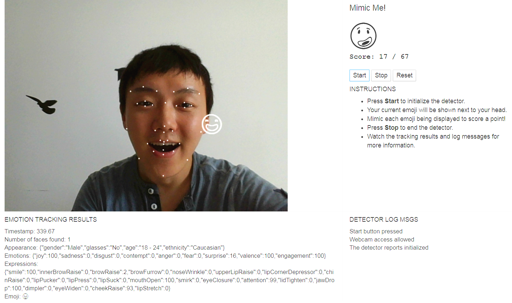

# Udacity Artificial Intelligence Nanodegree
## Computer Vision Lab: Mimic Me!

## Introduction

This Lab is part of the udacity AIND class (see my [aind](https://github.com/superkley/udacity-aind) repo) and uses Affectiva JS Demo SDK to detect the user's mimic from various facial marker points.

## Installation

* Create a SSL certificate 'my-ssl-cert.pem' used to serve over https:
```
$ generate-pemfile.sh
```
* launch local http server
```
$ python serve.py
```

## Demo

* [Demo Page on 2cn.de](https://www.2cn.de/mimic)


